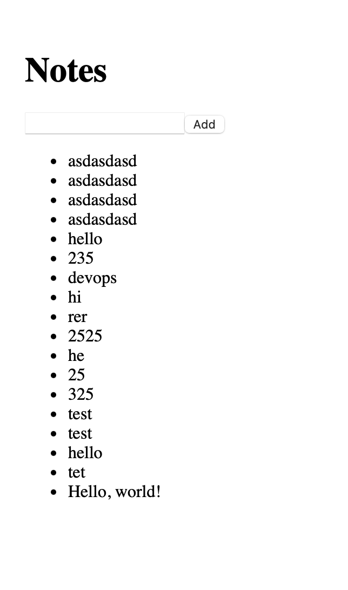
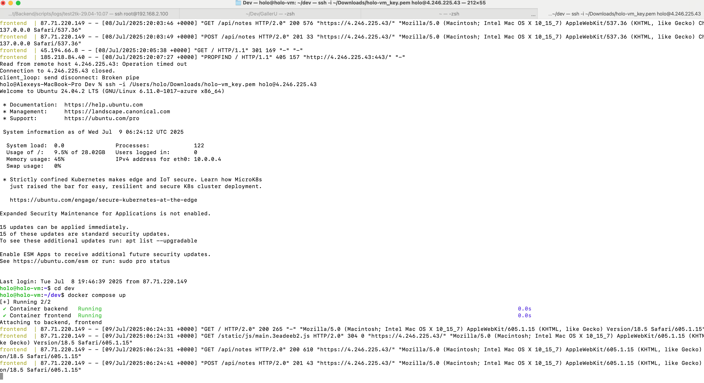

## My implementation of the 1st homework

Three decisions were made:

1) The database (notes.json file) was made persistent through docker mapping - in case we would like to do a backup, or persist between docker purges and server reboots. So the server has two files now: docker-compose.yml and notes.json which is mapped inside the *backend* container
2) Both frontend and backend Dockerfiles introduce an unprivileged user to run - it adds some Dockerfile code overhead to fix permissions, but is safer
3) Since it is a CRS, the nginx is inside the frontend container - no need to introduce the 3rd service, everything’s static


## 📸 Screenshots

| Terminal | Site |
|:--------:|:-------:|
|  |  |

# DevOps Course project

This is a playground project consisting of a frontend (React) and a backend (Node.js/Express) apps for deployment training.

---

## 🚀 Getting Started

### 🔧 Prerequisites

Make sure you have the following installed:

- [Node.js](https://nodejs.org/)
- npm (comes with Node.js)

---

## 📦 Install & Run

### ▶️ Frontend
```bash
cd frontend
npm install
npm start
```
### ▶️ Backend
```bash
cd backend
npm install
node index.js
```
---
